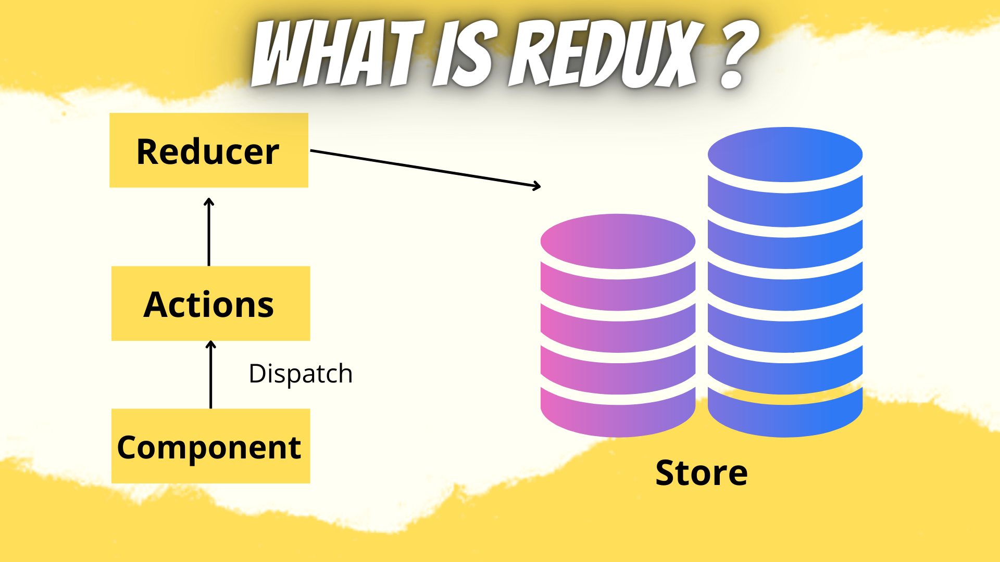

## REACT-REDUX 🧑‍💻💯

       
### Hello my name is Ayhan. this is article what is redux? i will explain . 

## What is redux ?

### Redux is simply a store to store the state of the variables in your app. Redux creates a process and procedures to interact with the store so that components will not just update or read the store randomly. Similar to the bank. It does not mean because you have money in the bank that you can go anytime, open the vault, and take money. You have to go through certain steps to withdrawal money.

### In the rest of the article, I will show how to create a Redux Hello World to explain how Redux works before adding it to React.

### In short, Redux is a way to manage the “state” or we can say it is a cache or storage that can be accessed by all components with a structured way. It has to be accessed through a “Reducer” and “Actions”




## Project 🧑‍💻

```js
npm install 
```

```js
npm run start
```

